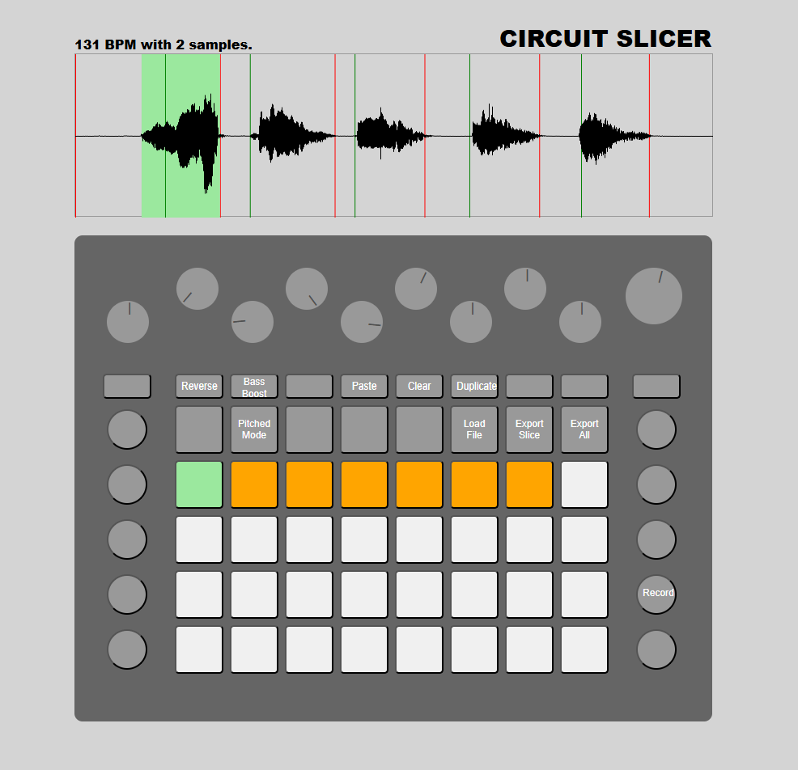

# circuit-slicer

Sampler and slicer for the Novation Circuit groovebox

Demo Here..
https://nigelskeels.github.io/circuit-slicer/

- Reverse samples
- Play samples as pitches
- Control via circuit hardware with midi
- Add samples from file
- Export edited sample or samples
- Adjust slice threshold
